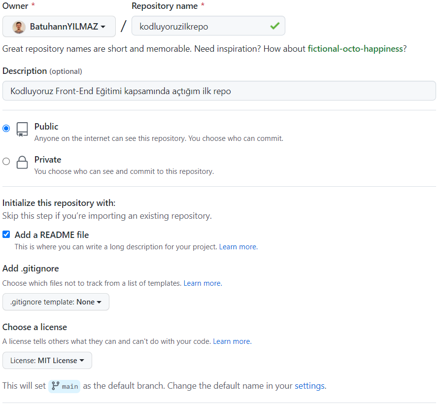

# **Kodluyourz Ilk Repo**


Bu repo [Kodluyoruz](https://kodluyoruz.org/tr/kodluyoruz/) Front-End Eğitiminde oluşturduğumuz ilk repo. İçerisinde bir adet README dosyası, bir adet de index.html barındırıyor.



## **Installation**
---

Öncelikle projeyi clonelayın.

```
https://github.com/BatuhannYILMAZ/kodluyoruzilkrepo.git
```

## **Usage**
---

Projeyi cloneladıktan sonra Visual Studio Code programında açınız.

Linux için:

```
cd kodluyoruzilkrepo 
code .
```

## **Contributing**
---

Pull requestler kabul edilir. Büyük değişiklikler için, Lütfen önce neyi değiştirmek istediğinizi tartışmak için bir konu açınız.


## **License**
---

[MIT](https://choosealicense.com/licenses/mit/)